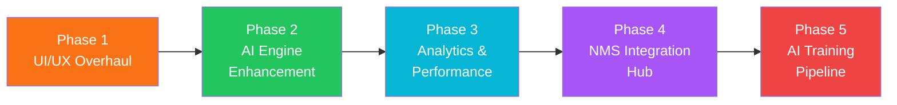
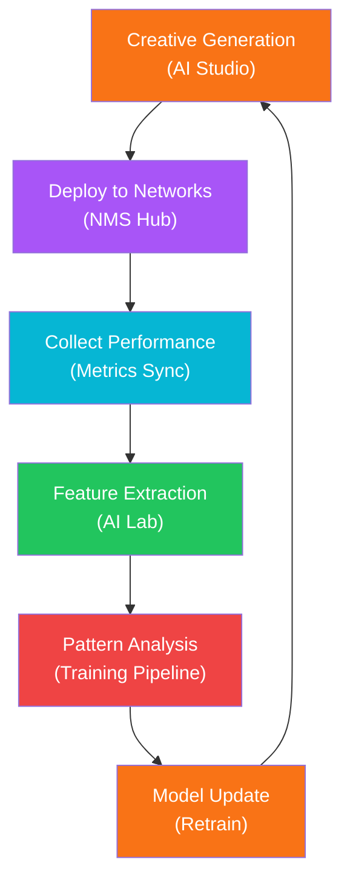

# iPlayable AI Studio — Kế Hoạch Tối Ưu UI/UX & Mở Rộng Tính Năng

## Bối Cảnh

iPlayable AI Studio là nền tảng quản lý và tạo playable ads (HTML5 interactive ads) cho ngành gaming mobile. Hệ thống hiện tại đã có:

- **Dashboard** với project grid, stats overview (mock data)
- **AI Magic Studio** với workflow 2 bước: Generate & Select → Detailed Edit & Publish
- **AI Copilot** pane với batch generation (50 variants), presets, chat interface
- **Settings/Controls** cho CTA, Images, Sound, Tutorial, Mechanic, Level, Direct-to-Store
- **Preview** với mobile mockup và deploy simulation
- **API layer** (mock) cho projects, variants, AI generation

### Đánh Giá Hiện Tại So Với Sản Phẩm Thực Tế

Dựa trên screenshots sản phẩm thực tế (iPlayable Ads production), có những khác biệt quan trọng:

| Tính năng | Production (Screenshots) | AI Studio (Codebase) |
|---|---|---|
| Dashboard/Statistics | Đầy đủ: pie chart, line chart, top mechanics, images/playable stats | Đơn giản: chỉ stats cards + project grid |
| Playable Ads List | Grid/List view với search, sort, pagination, status indicator | Chỉ có project cards, không có pagination |
| Quick Create | Upload dialog (drag & drop HTML/ZIP) | Không có |
| Project Detail | Hiển thị tất cả playable ads trong project với thumbnails | Nhảy thẳng vào Studio workspace |
| Playable Editor | Split-pane: Settings/Advanced tabs, Preview, Editor tabs, CTA/Images/Sound controls | AI-focused variant generator |
| Export | Multi-format export, network targeting | Mock deploy simulation |
| Mixed Creative | Chọn nhiều ads để ghép creative | Không có |

---

## Tổng Quan Kế Hoạch



---

## Phase 1: UI/UX Premium Overhaul

> [!IMPORTANT]
> Ưu tiên cao nhất — Nâng giao diện lên ngang tầm sản phẩm production với thiết kế premium, hiện đại hơn.

### 1.1 Dashboard Redesign

#### [MODIFY] [stats-overview.tsx](file:///c:/Users/iKame/Desktop/iPlayable/src/components/dashboard/stats-overview.tsx)
- Thêm animated counters (count-up animation)
- Gradient accent trên từng stat card
- Trend indicator (↑12% so với tuần trước)
- Micro-animation khi hover

#### [NEW] `src/components/dashboard/charts/activity-chart.tsx`
- Line chart "Tạo mới theo ngày" dùng Canvas/SVG thuần (không thêm chart library nặng)
- Interactive tooltips, responsive

#### [NEW] `src/components/dashboard/charts/status-pie-chart.tsx`
- Donut chart "Trạng thái" (Active/Inactive) với animated transitions

#### [NEW] `src/components/dashboard/charts/top-mechanics-chart.tsx`
- Bar chart horizontal cho "Top mechanics"

#### [NEW] `src/components/dashboard/charts/images-stats-chart.tsx`
- Bar chart cho "Images / playable" statistics

#### [MODIFY] [page.tsx (dashboard)](file:///c:/Users/iKame/Desktop/iPlayable/src/app/dashboard/page.tsx)
- Redesign layout: stats row → charts grid (2×2) → recent activity feed
- Glassmorphism subtle backgrounds

### 1.2 Sidebar Navigation Upgrade

#### [MODIFY] [sidebar.tsx](file:///c:/Users/iKame/Desktop/iPlayable/src/components/layout/sidebar.tsx)
- Thêm Quick Create button (orange gradient, prominent)
- User profile section ở bottom (avatar, name, email)
- Theme toggle button
- Badge count cho notifications
- Smooth expand/collapse với icon tooltips khi collapsed
- Active route highlight cải tiến (gradient indicator bar)

### 1.3 Playable Ads List Page

#### [NEW] `src/app/playable-ads/page.tsx`
- Main listing page cho tất cả playable ads
- Grid/List toggle view
- Search bar với debounce
- Sort dropdown (Ngày tạo, Tên, CTR, Status)
- Pagination component
- "Chọn nhiều" / "Mixed Creative" buttons

#### [NEW] `src/components/playable-ads/playable-card.tsx`
- Card component với thumbnail, status dot (active/inactive)
- Game code, variant count, ad network badges
- Hover effects (subtle scale + glow)
- Quick action menu (edit, duplicate, export, delete)

#### [NEW] `src/components/playable-ads/quick-create-dialog.tsx`
- Modal dialog cho upload nhanh
- Drag & drop zone cho HTML/ZIP files
- File validation (max 50MB per file, max 10 files)
- Progress indicators per file
- "Tạo X playable ads" action button

### 1.4 Project Detail Page (Playable Ads in Project)

#### [NEW] `src/app/playable-ads/[projectId]/page.tsx`
- Breadcrumb navigation (Projects > Project Name > Playable Ads)
- Grid of playable ad cards trong project đó
- Search, sort, filter within project
- "Chọn nhiều" mode cho batch operations

### 1.5 Playable Editor Enhancement

#### [MODIFY] [studio-workspace.tsx](file:///c:/Users/iKame/Desktop/iPlayable/src/components/studio/studio-workspace.tsx)
- Thêm tabs: Settings | Advanced (như production)
- Thêm tabs cho Preview: Preview | Editor
- Enhanced toolbar: Save, Export dropdown, Reset Factory
- Version indicator (tra.cp1, v22, etc.)
- File size badge, asset count, error count

#### [MODIFY] [preview-pane.tsx](file:///c:/Users/iKame/Desktop/iPlayable/src/components/studio/preview-pane.tsx)
- Multi-device preview (Phone portrait, Phone landscape, Tablet, Desktop)
- Zoom controls (-, slider, +, fit, rotate)
- Auto-apply toggle
- File size indicator
- Asset & error counters

#### [MODIFY] [mobile-mockup.tsx](file:///c:/Users/iKame/Desktop/iPlayable/src/components/studio/mobile-mockup.tsx)
- Realistic device frames cho iPhone/Android
- Dynamic srcDoc từ actual HTML playable content
- Touch event simulation
- Responsive scaling

#### [MODIFY] [settings-pane.tsx](file:///c:/Users/iKame/Desktop/iPlayable/src/components/studio/settings-pane.tsx)
- Image management với thumbnails (Original → Display)
- Sound section với background music toggle, volume slider
- Enhanced CTA section với enable/disable toggle
- "Revert All" button cho images section
- Sorting dropdown cho images (Không sắp xếp, Theo kích thước, Theo loại)

### 1.6 Global Design System Update

#### [MODIFY] [globals.css](file:///c:/Users/iKame/Desktop/iPlayable/src/app/globals.css)
- Custom scrollbar styles
- Glass-morphism utility classes
- Gradient text utilities
- Enhanced focus states
- Smooth page transitions

#### [MODIFY] [tailwind.config.ts](file:///c:/Users/iKame/Desktop/iPlayable/tailwind.config.ts)
- Expanded color palette (success, warning, danger, info)
- Container queries support
- Additional animations (slideUp, fadeIn, shimmer)

---

## Phase 2: AI Engine Enhancement

> [!IMPORTANT]
> Nâng cấp AI từ mock generation thành intelligent assistant thực sự.

### 2.1 Real AI Integration

#### [MODIFY] [openai.ts](file:///c:/Users/iKame/Desktop/iPlayable/src/lib/openai.ts)
- Kết nối thực với OpenAI GPT-4o qua API
- Structured output (JSON mode) cho VariantConfig generation
- Temperature tuning cho creative diversity
- Streaming response support

#### [NEW] `src/lib/ai/prompt-templates.ts`
- Library prompt templates tối ưu cho từng use case:
  - `BATCH_GENERATION`: Sinh hàng loạt variant configurations
  - `CREATIVE_OPTIMIZATION`: Gợi ý tối ưu dựa trên performance data
  - `COMPETITIVE_ANALYSIS`: Phân tích và đề xuất dựa trên benchmark
  - `IMAGE_SUGGESTION`: Gợi ý image replacements
  - `CTA_OPTIMIZATION`: Tối ưu CTA text/color/position

#### [NEW] `src/lib/ai/performance-predictor.ts`
- ML-based CTR/CVR prediction thay vì mock formula
- Feature extraction từ VariantConfig
- Historical data learning
- Confidence intervals

### 2.2 Smart AI Copilot

#### [MODIFY] [ai-copilot-pane.tsx](file:///c:/Users/iKame/Desktop/iPlayable/src/components/studio/ai-copilot-pane.tsx)
- **Context-aware suggestions**: AI hiểu project hiện tại và historical performance
- **Multi-turn conversation**: Giữ context qua nhiều lượt chat
- **Action buttons**: Quick action chips ("Tối ưu CTA", "Thêm game mechanic", "Giảm file size")
- **Visual suggestions**: AI suggest kèm preview thumbnails
- **Undo/Redo stack**: Cho mỗi AI modification

#### [NEW] `src/components/studio/ai-suggestion-card.tsx`
- Card hiển thị AI suggestion với:
  - Before/After comparison
  - Predicted impact (CTR +0.5%, CVR +0.2%)
  - One-click apply
  - Explanation text

### 2.3 Intelligent Automation

#### [NEW] `src/lib/ai/auto-optimizer.ts`
- **Auto-optimize pipeline**: Chạy tự động khi tạo variant mới
  - CTA color contrast check
  - File size optimization suggestions
  - Sound volume normalization
  - Tutorial steps recommendation based on mechanic complexity
  - Difficulty calibration

#### [NEW] `src/components/studio/ai-auto-optimize-panel.tsx`
- Panel hiển thị danh sách optimizations được AI suggest
- Toggle on/off từng optimization
- "Apply All Recommended" button
- Impact score cho mỗi suggestion

### 2.4 AI Image Generation & Enhancement

#### [NEW] `src/lib/ai/image-generator.ts`
- Tích hợp DALL-E 3 / Stable Diffusion API
- Generate background images từ text prompt
- Sprite replacement suggestions
- CTA button design generation
- End card template generation

#### [NEW] `src/components/studio/ai-image-studio.tsx`
- UI cho AI image generation
- Prompt input + style presets (Cartoon, Realistic, Pixel Art, Neon)
- Generated image gallery
- Drag to apply to playable

---

## Phase 3: Analytics & Performance Intelligence

### 3.1 Analytics Dashboard

#### [MODIFY] [analytics/page.tsx](file:///c:/Users/iKame/Desktop/iPlayable/src/app/analytics/page.tsx)
- Full analytics dashboard (không còn placeholder)

#### [NEW] `src/components/analytics/performance-overview.tsx`
- KPI cards: Total Impressions, Avg CTR, Avg CVR, Total Installs, eCPM, ROAS
- Trend sparklines
- Date range picker

#### [NEW] `src/components/analytics/creative-heatmap.tsx`
- Heatmap visualization cho user interaction patterns
- Click density map trên playable preview
- Time-to-first-interaction analysis
- Drop-off point indicators

#### [NEW] `src/components/analytics/ab-test-panel.tsx`
- A/B test configuration UI
- Traffic split controls
- Statistical significance calculator
- Winner declaration automation
- Test history timeline

#### [NEW] `src/components/analytics/variant-comparison.tsx`
- Side-by-side variant performance comparison
- Radar chart cho multi-dimension comparison
- CTR, CVR, Engagement Rate, Completion Rate, Install Rate
- Auto-highlight winning dimensions

### 3.2 Performance Prediction Engine

#### [NEW] `src/components/analytics/prediction-panel.tsx`
- AI-powered performance forecast cho variants chưa deploy
- "What-if" scenario builder
- Confidence intervals visualization
- Recommendation summary

### 3.3 Reporting System

#### [NEW] `src/app/analytics/reports/page.tsx`
- Scheduled report builder
- Template library (Weekly Performance, Monthly Creative Review, Campaign Summary)
- Export formats: PDF, CSV, Google Sheets integration
- Email scheduling

---

## Phase 4: NMS (Network Management System) Integration Hub

> [!WARNING]
> Phase này yêu cầu API credentials thực từ các ad networks. Implementation ban đầu sẽ dùng mock data + interface scaffolding sẵn sàng cho integration thực.

### 4.1 Network Hub Dashboard

#### [NEW] `src/app/networks/page.tsx`
- Central hub cho tất cả ad network integrations
- Network health status (connected/disconnected/syncing)
- Last sync timestamps
- Quick actions per network

#### [NEW] `src/components/networks/network-card.tsx`
- Card cho mỗi network: AppLovin, Unity Ads, IronSource, Mintegral, Facebook, Google Ads
- Connection status badge
- Metric summary (impressions, revenue, fill rate)
- Configure/Reconnect buttons

### 4.2 Creative Distribution Pipeline

#### [NEW] `src/lib/networks/network-adapter.ts`
- Abstract adapter interface cho mỗi ad network
- Methods: `uploadCreative()`, `pullMetrics()`, `syncStatus()`, `getRequirements()`

#### [NEW] `src/lib/networks/applovin-adapter.ts`
- AppLovin MAX API integration
- Creative upload (HTML5 zip)
- Campaign metrics pull
- Ad unit configuration

#### [NEW] `src/lib/networks/unity-adapter.ts`
- Unity Ads / LevelPlay API integration

#### [NEW] `src/lib/networks/mintegral-adapter.ts`
- Mintegral API integration

#### [NEW] `src/components/networks/distribution-wizard.tsx`
- Step-by-step wizard: Select variants → Choose networks → Configure per-network settings → Review → Deploy
- Network-specific validation (file size limits, format requirements)
- Batch deploy progress tracking

### 4.3 Cross-Network Performance Sync

#### [NEW] `src/lib/networks/metrics-aggregator.ts`
- Pull metrics từ tất cả connected networks
- Normalize data format
- Calculate unified KPIs
- Detect anomalies (sudden CTR drops, budget overrun)

#### [NEW] `src/components/networks/cross-network-report.tsx`
- Comparison table/chart: Performance by network
- Revenue attribution
- Best performing network per creative
- Network-specific optimization suggestions

### 4.4 Auto-Optimization Loop

#### [NEW] `src/lib/networks/auto-optimizer.ts`
- **Automated rules engine**:
  - Pause under-performing creatives (CTR < threshold)
  - Scale winning creatives (increase budget allocation)
  - Rotate creatives to prevent ad fatigue
  - Network-specific bid adjustments
- Notification system cho manual review triggers
- Rule builder UI

---

## Phase 5: AI Training Pipeline — Nhận Diện & Sinh Tạo Playable Ads Hiệu Quả

> [!CAUTION]
> Đây là phase phức tạp nhất, yêu cầu infrastructure cho ML training. Phase này thiết kế architecture và UI, actual training sẽ cần backend ML infrastructure riêng.

### 5.1 Creative Intelligence Database

#### [NEW] Database schema updates (Prisma)
```prisma
model CreativePerformance {
  id              String   @id @default(cuid())
  variantId       String
  network         String
  impressions     Int      @default(0)
  clicks          Int      @default(0)
  installs        Int      @default(0)
  ctr             Float    @default(0)
  cvr             Float    @default(0)
  revenue         Float    @default(0)
  recordedAt      DateTime @default(now())
}

model CreativeFeature {
  id              String   @id @default(cuid())
  variantId       String
  mechanicType    String
  ctaColor        String
  ctaPosition     String
  difficulty      Int
  tutorialSteps   Int
  soundEnabled    Boolean
  fileSize        Int
  imageCount      Int
  hasAnimation    Boolean
  duration        Int
  extractedAt     DateTime @default(now())
}

model TrainingDataset {
  id              String   @id @default(cuid())
  name            String
  description     String?
  sampleCount     Int      @default(0)
  status          String   @default("Collecting")
  createdAt       DateTime @default(now())
  updatedAt       DateTime @updatedAt
}

model AIModel {
  id              String   @id @default(cuid())
  name            String
  version         String
  type            String   // "predictor" | "generator" | "classifier"
  accuracy        Float?
  status          String   @default("Training")
  config          Json
  createdAt       DateTime @default(now())
}
```

### 5.2 Feature Extraction Pipeline

#### [NEW] `src/lib/ai/feature-extractor.ts`
- Phân tích HTML5 playable ad source code
- Extract: game mechanics, visual style, interaction pattern, CTA design
- Image analysis (color palette, complexity score)  
- Sound analysis (BPM, energy level)
- Calculate complexity score

### 5.3 Training Dashboard

#### [NEW] `src/app/ai-lab/page.tsx`
- AI Lab main page

#### [NEW] `src/components/ai-lab/model-overview.tsx`
- Dashboard cho AI models management
- Model cards: Name, version, accuracy, status (Training/Ready/Deployed)
- Training history timeline
- Performance metrics per model

#### [NEW] `src/components/ai-lab/dataset-manager.tsx`
- Manage training datasets
- Data collection status
- Quality metrics (missing data, outliers)
- Export/Import datasets

#### [NEW] `src/components/ai-lab/training-monitor.tsx`
- Real-time training progress
- Loss/Accuracy curves (SVG charts)
- Epoch counter
- Early stopping indicators
- Resource usage (GPU, Memory)

### 5.4 Pattern Recognition Engine

#### [NEW] `src/lib/ai/pattern-recognition.ts`
- Phân tích patterns từ top-performing playable ads:
  - Winning mechanic types by genre
  - Optimal CTA configurations
  - Best color palettes by audience
  - Ideal difficulty curves
  - Tutorial effectiveness patterns

#### [NEW] `src/components/ai-lab/insights-panel.tsx`
- Hiển thị discovered patterns
- "Winning Formula" recommendations
- Trend detection (rising/falling patterns)
- Genre-specific insights

### 5.5 Smart Generator (AI Creative Engine)

#### [NEW] `src/lib/ai/creative-engine.ts`
- Engine sinh playable ads configurations dựa trên:
  - Historical performance data
  - Target audience segments
  - Campaign objectives
  - Budget constraints
  - Network requirements
- Multi-objective optimization (maximize CTR + CVR + ROAS)

#### [NEW] `src/components/ai-lab/creative-generator.tsx`
- UI cho AI-powered creative generation
- Input: Campaign brief (target audience, genre, budget, goals)
- Output: Ranked list of recommended configurations
- Each comes with predicted performance + confidence score
- One-click create from recommendation

### 5.6 Feedback Loop

#### [NEW] `src/lib/ai/feedback-collector.ts`
- Tự động collect kết quả thực tế từ deployed ads
- So sánh predicted vs actual performance
- Tính sai số và cập nhật model
- AB test result aggregation



---

## User Review Required

> [!IMPORTANT]
> **Quyết định về phạm vi triển khai**: Kế hoạch này rất lớn. Đề xuất triển khai theo thứ tự ưu tiên:
> - **Sprint 1 (Immediately)**: Phase 1.1–1.6 (UI/UX Overhaul) — thiết kế lại toàn bộ giao diện
> - **Sprint 2**: Phase 2.1–2.4 (AI Engine) — nâng cấp AI capabilities
> - **Sprint 3**: Phase 3 (Analytics) — xây dựng analytics đầy đủ
> - **Sprint 4**: Phase 4 (NMS) — scaffolding cho network integrations
> - **Sprint 5**: Phase 5 (AI Training) — architecture cho ML pipeline

> [!WARNING]
> **Mock vs Real API**: Phase 2–5 sẽ cần backend infrastructure thực (OpenAI API key, ad network credentials, ML training server). Implementation ban đầu sẽ dùng mock data + đầy đủ UI, sẵn sàng swap sang real APIs.

## Open Questions

1. **Bạn muốn bắt đầu từ phase nào?** Tôi đề xuất Phase 1 (UI/UX) trước vì nó tạo nền tảng cho tất cả tính năng sau.

2. **Ad networks ưu tiên**: Trong Phase 4, bạn muốn ưu tiên tích hợp network nào trước? (AppLovin MAX, Unity Ads, Mintegral, Facebook, Google Ads?)

3. **AI Provider**: Bạn muốn dùng OpenAI (GPT-4o) hay có preference khác cho AI engine? (Gemini, Claude, local model?)

4. **Database**: Prisma + PostgreSQL hiện tại có phù hợp cho scale lớn không? Hay cần cân nhắc thêm Redis cache, message queue cho training pipeline?

5. **Ngôn ngữ giao diện**: Sản phẩm production dùng tiếng Việt, nhưng codebase hiện tại mix Việt-Anh. Bạn muốn giao diện hoàn toàn tiếng Việt, hoàn toàn tiếng Anh, hay i18n support?

---

## Verification Plan

### Automated Tests
- Visual regression testing với browser screenshots sau mỗi phase
- Component render tests cho tất cả new components
- API route testing cho new endpoints
- Store unit tests cho new Zustand stores

### Manual Verification
- Browser testing trên Chrome, Safari, Firefox
- Responsive testing (1280px, 1440px, 1920px, mobile)
- Dark mode consistency check
- Animation performance profiling (target 60fps)
- Accessibility audit (keyboard navigation, screen reader)

### Quality Gates
- Lighthouse score ≥ 90 (Performance, Accessibility)
- Bundle size < 500KB (initial load)
- FCP < 1.5s, LCP < 2.5s
- No layout shifts (CLS < 0.1)
